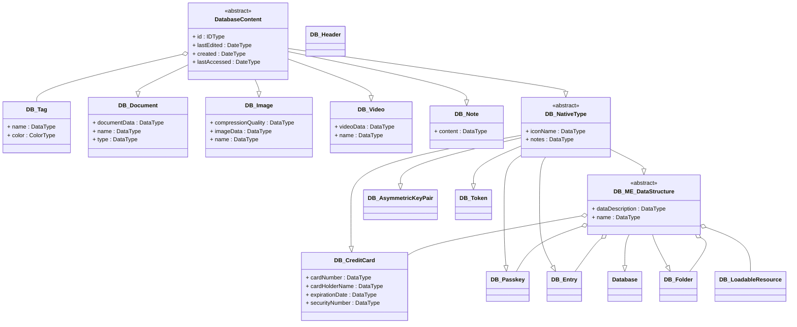

# Datatypes

A summary over all data types used in Protecto Pass

## Overview

This Page shows an overview over all data types and the inheritance of them.

The following diagram shows a quick overview without going into details. The following sections will explain the different data types in more detail.

````mermaid
mindmap DatabaseContent
    DB_Document
    DB_Image
    DB_Video
    DB_Note
    DB_NativeType
        DB_Passkey
        DB_CreditCard
        DB_Entry
        DB_ME_DataStructure
            Database
            DB_Folder
````

## Class Diagram


